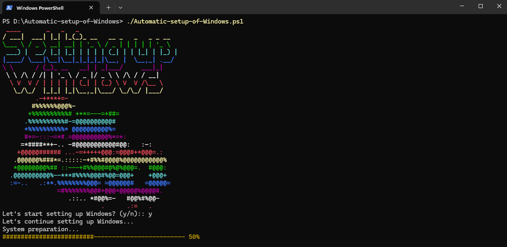

# Project: Automatic-setup-of-Windows


# About 

**Automatic-setup-of-Windows** This project is a PowerShell script for automatic Windows configuration after the operating system installation. The script allows to significantly reduce the time for system configuration, providing automatic installation of applications, changing parameters, setting up the environment and other tasks required by the user.


<br />



<br />

## Quick start

> 👉 Download the code  

```bash
$ https://github.com/ilalutovinov/Pearl-OS.git
$ cd Pearl-OS 
```

<br />

> 👉 Install modules via `VENV`  

```bash
$ python -m venv env
$ .\env\Scripts\Activate
```

<br />


> 👉 Performing the migration

```bash
$ python manage.py migrate
```

<br />

> 👉 Start the app

```bash
$ python manage.py runserver
```

At this point, the app runs at `http://127.0.0.1:8000/`. 

<br />
